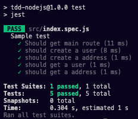

## TDD com NodeJs
TDD significa Desenvolvimento Orientado por Testes (Test Driven Development), e trata-se de uma prática de desenvolvimento de software onde a codificação das funcionalidades começa a partir da escrita de testes unitários. Esse repositório tem como objetivo ser uma introdução ao uso de TDD com NodeJs, jest e supertest. 

### Dependencias
Para rodar o projeto se faz necessário a instalação [NodeJs](https://nodejs.org/en/) e o gerenciador de pacotes [NPM](https://www.npmjs.com/).

### Screenshots 
<div>
    
</div>

### Como rodar

* Clonar repositório:

``` shell
git clone https://github.com/victordsantoss/TDD-NodeJs.git 
git clone git@github.com:victordsantoss/TDD-NodeJs.git
```

* Instalar dependências (pasta raiz do repositório):

``` shell
npm install 
```

* Iniciar servidor api(pasta raiz do repositório):

``` shell
npm start 
```

* Iniciar testes(pasta raiz do repositório):

``` shell
npm test 
```